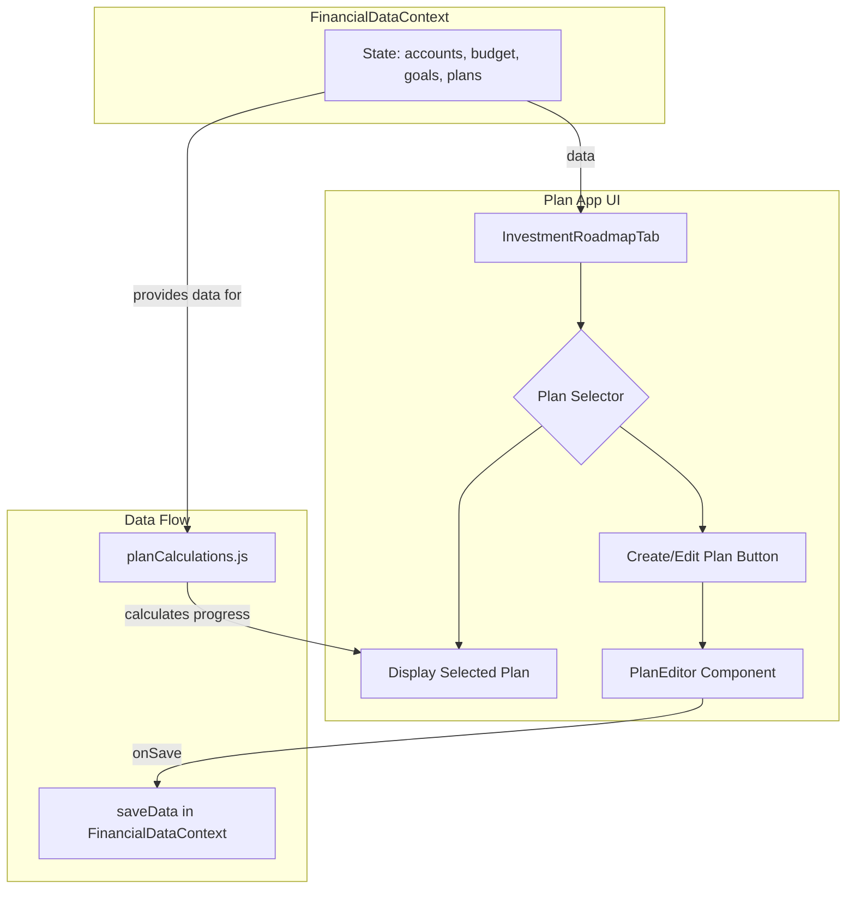

# Plan for "Plans" App

This document outlines the plan for implementing a customizable "Plans" app within the existing financial dashboard.

## High-Level Plan

1.  **Data Model:** Introduce a new `plans` array to the `FinancialDataContext`. Each object in this array will represent a user-created plan and will contain a list of `milestones`.
2.  **UI for Plan Creation:** Create a new UI for creating and editing plans. This will allow users to define the plan's name, description, and add, edit, or remove milestones.
3.  **Milestone Configuration:** Each milestone will be configurable with a name, target amount, and a "linked source" (e.g., an existing goal, an account, or a custom value).
4.  **Progress Calculation:** Create a new utility function to calculate the progress of each plan based on its milestones and their linked sources.
5.  **Displaying Plans:** Modify the `InvestmentRoadmapTab` to display user-created plans alongside the existing prescriptive roadmap. Users will be able to switch between different plans.
6.  **Data Synchronization:** Leverage the existing `saveData` function in `FinancialDataContext` to ensure that any changes to plans are persisted and that plan progress is updated whenever the underlying financial data changes.

## Detailed Breakdown

### 1. Data Model (`FinancialDataContext.jsx`)

A `plan` object will have the following structure:

```javascript
{
  id: 'plan-1',
  name: 'Path to Early Retirement',
  description: 'My personal roadmap to financial independence.',
  milestones: [
    {
      id: 'milestone-1',
      name: 'Emergency Fund',
      targetAmount: 15000,
      linkedSource: {
        type: 'goal', // 'goal', 'account', or 'custom'
        id: 'goal-emergency-fund'
      }
    },
    {
      id: 'milestone-2',
      name: 'Pay Off Car Loan',
      targetAmount: 0,
      linkedSource: {
        type: 'account',
        id: 'account-car-loan'
      }
    }
  ]
}
```

### 2. UI for Plan Creation (`src/features/Dashboard/Apps/Plan/components/PlanEditor.jsx`)

A new component will be created for creating and editing plans. This will be a form where users can:

- Enter a plan name and description.
- Add new milestones.
- For each milestone, specify a name, target amount, and select a linked source from a dropdown (populated with existing goals and accounts).

### 3. Progress Calculation (`src/utils/planCalculations.js`)

A new utility function will be created to calculate plan progress.

```javascript
// src/utils/planCalculations.js
export const calculatePlanProgress = (plan, goals, accounts) => {
  let totalTarget = 0;
  let totalCurrent = 0;

  plan.milestones.forEach((milestone) => {
    totalTarget += milestone.targetAmount;
    if (milestone.linkedSource.type === "goal") {
      const goal = goals.find((g) => g.id === milestone.linkedSource.id);
      if (goal) {
        totalCurrent += goal.currentAmount;
      }
    } else if (milestone.linkedSource.type === "account") {
      const account = accounts.find((a) => a.id === milestone.linkedSource.id);
      if (account) {
        // Handle debt accounts where the goal is to reach 0
        if (account.type === "debt") {
          totalCurrent += milestone.targetAmount - Math.abs(account.value);
        } else {
          totalCurrent += account.value;
        }
      }
    }
  });

  return (totalCurrent / totalTarget) * 100;
};
```

### 4. Displaying Plans (`InvestmentRoadmapTab.jsx`)

The `InvestmentRoadmapTab` will be modified to:

- Fetch the `plans` from `FinancialDataContext`.
- Display a dropdown to select a plan (including the default "Investment Roadmap").
- Render the selected plan's milestones and progress.

### Mermaid Diagram


