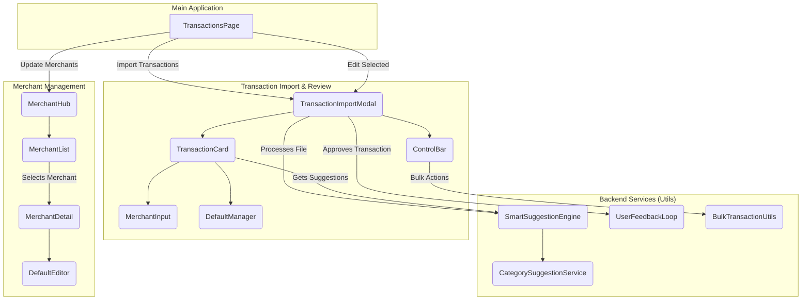

# Project Implementation Plan: Transaction Management System Overhaul

This plan details the engineering and UI/UX steps required to build the new system. Each phase and step is designed to be a self-contained block of work.

### **Component Architecture Diagram**

First, let's visualize the target component architecture. This diagram illustrates how the new, modular components will interact.

---

### **Phase 1: The Transaction Import & Review Modal (`TransactionImportModal.jsx`)**

The goal of this phase is to dismantle the existing monolithic modal and rebuild it with modular, reusable components.

**Step 1.1: File Upload & Initial Processing**

- **Task:** Create a new, dedicated component for the initial file upload step.
- **Components:**
  - `FileUploadStep.jsx`: A simple component that contains the account selection dropdown and the file input.
- **Backend Logic:**
  - The file parsing logic using `Papa.parse` from lines `161-248` in `TransactionImportModal.jsx` will be moved into a dedicated utility function in the `SmartSuggestionEngine` (Phase 4). This function will take the file and return the array of pre-processed transaction objects.

**Step 1.2: Main UI Layout**

- **Task:** Rebuild the main modal UI to support the new split-screen layout and control bar.
- **Components:**
  - `TransactionImportModal.jsx` (Refactored): This will become a container component that manages the overall state (`transactions`, `approved`, `toReview`), but delegates rendering to child components.
  - `ControlBar.jsx`: A new component to house the progress bar and action buttons (`Approve All`, `Undo`, `Reset`, `Manage Merchants`). This will extract the logic from lines `768-834` of the existing modal.
  - `TransactionReviewList.jsx`: A component to render the list of `TransactionCard` components. It will manage the "To Review" and "Approved" columns.

**Step 1.3: Individual Transaction Card UI**

- **Task:** Create a reusable card component for a single transaction.
- **Components:**
  - `TransactionCard.jsx`: This new component will display the "Initial" (raw data) and "Suggested" (interactive form) sections. It will receive a single transaction object as a prop and manage its own state for edits. This replaces the large block of JSX from lines `865-1469` in the current modal.

**Step 1.4: Interactive Merchant Selection**

- **Task:** Build an intuitive and powerful merchant input component.
- **Components:**
  - `MerchantInput.jsx`: A new component that will replace the simple text input for the merchant name. It will include:
    - The text input field with auto-suggestions for existing merchants.
    - A `+` icon button to trigger a small inline form or modal for creating a new custom merchant.
    - A `folder` icon button to open a searchable list of existing merchants.
- **Logic:** This component will encapsulate the logic currently found in lines `929-1042` of `TransactionImportModal.jsx`.

**Step 1.5: Interactive Default Management**

- **Task:** Create an inline component for managing defaults for a specific transaction.
- **Components:**
  - `DefaultManager.jsx`: A new component to be placed within the `TransactionCard`. It will handle:
    - Displaying the `New Default` or `Defaults (#)` button.
    - Showing a menu to select from existing defaults.
    - Providing an inline form to create a new default based on the current transaction's "Suggested" state.
    - Implementing the "Apply this default to all X other transactions" feature by calling the `BulkTransactionUtils` service.
- **Logic:** This will replace the logic and UI for the `NamedDefaultsManager` currently invoked in `TransactionImportModal.jsx`.

---

### **Phase 2: The "Manage Merchants" Hub**

This phase involves creating a centralized, user-friendly hub for all merchant-related management, replacing the existing, fragmented components.

**Step 2.1: Hub UI & Merchant List**

- **Task:** Create a new page or modal for the Merchant Hub.
- **Components:**
  - `MerchantHub.jsx`: This will be the main container for the hub. It will replace `MerchantManager.jsx` and `EnhancedMerchantManager.jsx`.
  - `MerchantList.jsx`: A component that displays a searchable list of all custom merchants.

**Step 2.2: Merchant Detail View**

- **Task:** Design the view for a single merchant's details.
- **Components:**
  - `MerchantDetail.jsx`: When a merchant is selected from the `MerchantList`, this component will display:
    - An editable field for the `customName`.
    - A list of `rawMappings`, with the ability to add or remove them.
    - A list of associated `Defaults`.

**Step 2.3: Default Management within the Hub**

- **Task:** Allow users to manage a merchant's defaults directly within the hub.
- **Components:**
  - `DefaultEditor.jsx`: A component, styled identically to the "Suggested" section of the `TransactionCard`, that allows for editing an existing default's properties or creating a new one. Users will also be able to set a default as the `isMainDefault`.

---

### **Phase 3: Integration with Main Application**

This phase ensures the new import system is seamlessly integrated into the existing application workflow.

**Step 3.1: Final Import & Transactions Table**

- **Task:** Finalize the import process and update the main transactions table.
- **Logic:** The `handleFinalize` function (lines `446-491` in `TransactionImportModal.jsx`) will be updated to use the new data models. Upon successful import, it will trigger a refresh of the data displayed in the main `TransactionsTable.jsx`.

**Step 3.2: Transactions Page Action Bar**

- **Task:** Create the new action bar on the main transactions page.
- **Components:**
  - `TransactionActions.jsx`: This existing component will be updated to include the new buttons: `Import Transactions` (launches `TransactionImportModal`) and `Update Merchants` (launches `MerchantHub`).

**Step 3.3: In-Place Editing Functionality**

- **Task:** Enable editing of existing transactions using the new import modal.
- **Logic:**
  - The main `TransactionsTable.jsx` will have checkboxes for row selection.
  - An `Edit Selected` button will be added to `TransactionActions.jsx`.
  - When clicked, the `TransactionImportModal` will be opened in an "edit mode," pre-populated with the selected transactions. The same review and approval workflow can be used to apply changes.

---

### **Phase 4: Backend Logic & Smart Services**

This phase focuses on refactoring and enhancing the backend utility functions to create more robust and intelligent services.

**Step 4.1: Smart Suggestion Engine (`getMerchantNameSuggestions`)**

- **Task:** Consolidate and enhance the merchant recognition logic.
- **Utils to Refactor:**
  - `suggestionUtils.js`
  - `merchantPatterns.js`
  - `customMerchantNames.js`
  - `merchantHistory.js`
- **New Service:** `SmartSuggestionEngine.js`
  - This new service will have a primary function, `getSmartSuggestions(rawTransaction)`, that orchestrates the suggestion process in the specified order of priority: Exact Raw Match, Pattern Matching, Historical User Choices, and Similarity Analysis.

**Step 4.2: Category Suggestion Service (`categories.js`)**

- **Task:** Improve the category suggestion logic.
- **Utils to Refactor:**
  - The keyword matching logic in `suggestionUtils.js`.
- **New Service:** `CategorySuggestionService.js`
  - This service will suggest categories based on keywords and historical data, especially for unrecognized merchants.

**Step 4.3: User Feedback Loop & Learning**

- **Task:** Strengthen the system's learning capabilities.
- **Logic:** The logic for `recordMerchantChoice` and `setCustomMerchantName` will be centralized into a `UserFeedbackLoop` service. This service will be responsible for updating the `Merchant` and `Default` models whenever a user approves a transaction or creates a new default.

**Step 4.4: Bulk Transaction Matching (`bulkTransactionUtils.js`)**

- **Task:** Refactor the bulk operation utilities.
- **Utils to Refactor:**
  - `bulkTransactionUtils.js`
- **New Service:** `BulkTransactionUtils.js` (Refactored)
  - The functions in this utility will be updated to work with the new data models and component structure, ensuring features like "Apply to all" work correctly.
